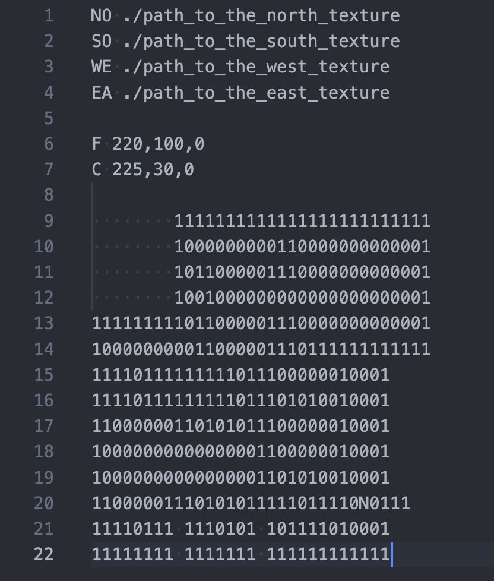
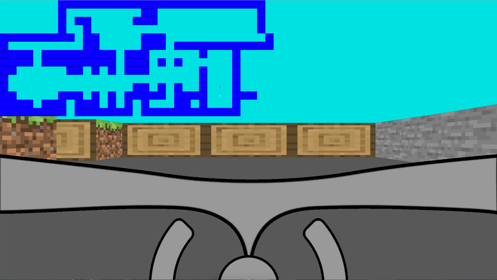

# Description

This is a simple raycasting 3d game / program where you move around 2d map.
It uses a raycasting algorithm to find the distance of the player to the wall.
It then prints out an aimage of the wall according to the distance.

## Installation

Run the makefile.

```bash
make
```

## Usage


format: ./cub3d {map directory}

example:

```bash
./cub3d maps/pdf.cub
```

## Map



First segment incudes the path for wall textures along with the direction of the wall texture.

Second segment is the color for the floor and ceiling.

Last segment is the 2d map itself. '1' representing a wall, '0' representing empty cell, 'N/S/E/W' depicting the player start position as well as the direction it faces.

## Game preview



Dark blue blocks: Wall blocks

Yellow dot: player position

Red dot: player view direction

## Contributors

image and map redering:
https://github.com/lwwilliam

game logic and raycasting:
https://github.com/sealw4ll
